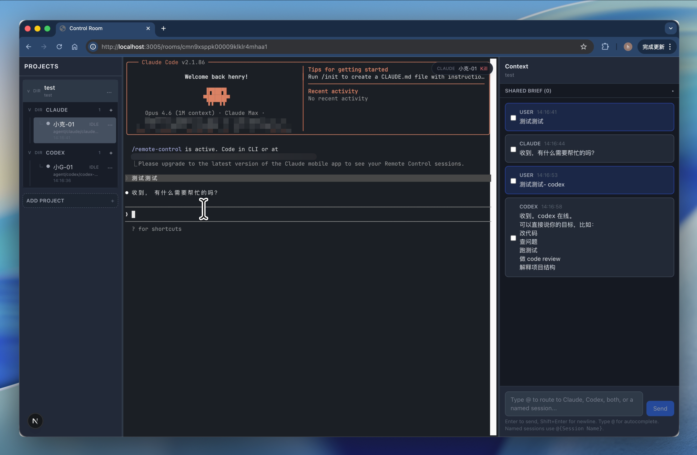

# Control Room

A local-first web console for orchestrating multiple AI coding agents (Claude, Codex) from a single interface.



> **Security Notice:** This application has **no authentication**. The backend listens on all interfaces by default and all API/WebSocket endpoints are unauthenticated. **Do not expose the server port to a network you don't trust.** It is designed to run on your local machine only. If you must run it on a remote server, put it behind a VPN or SSH tunnel.

## What it does

Control Room lets you run Claude CLI and Codex CLI side by side in your browser, with real interactive terminals — not a watered-down wrapper. You get:

- **Multiple sessions** — Run several Claude and Codex sessions per project, each with its own terminal
- **Real terminals** — Full interactive CLI experience with xterm.js (scrollback, mouse, slash commands all work)
- **Cross-agent messaging** — Select chat messages and forward context to another agent or session
- **Persistent terminals** — Close your browser tab, come back later, your sessions are still alive (while the server is running)
- **Local-first** — Everything runs on your machine. No cloud, no accounts, SQLite for storage

## Architecture

```
┌─────────────┬──────────────────┬──────────────┐
│  Session    │    Terminal       │   Context    │
│  Tree       │    (xterm.js)    │   Panel      │
│             │                  │              │
│  Projects   │  Real PTY ──────►│  Chat log    │
│  └─ Claude  │  via WebSocket   │  Handoff     │
│  └─ Codex   │                  │  Pinned brief│
└─────────────┴──────────────────┴──────────────┘
        ▲               ▲               ▲
        │               │               │
        └───── Next.js (frontend) ──────┘
                        │
                    WebSocket
                        │
                Fastify (backend)
                   │         │
              node-pty    Prisma/SQLite
```

**Monorepo layout:**

```
apps/
  web/          # Next.js frontend
  server/       # Fastify + WebSocket + PTY management
packages/
  shared-types/ # Shared TypeScript types
prisma/
  schema.prisma
data/
  room.db       # SQLite database (auto-created)
```

## Prerequisites

- **Node.js** >= 20
- **pnpm** >= 10
- **Claude CLI** (`claude`) and/or **Codex CLI** (`codex`) installed and authenticated

## Quick Start

```bash
# Clone and install
git clone https://github.com/henry33234424/agent-control-room.git
cd agent-control-room
pnpm install

# Set up the database
cp .env.example .env
pnpm db:generate
pnpm db:migrate

# Start development servers
pnpm dev
```

Open **http://localhost:3005** in your browser.

## Usage

1. **Add a project** — Click "ADD PROJECT" in the sidebar and enter the path to your code directory
2. **Create sessions** — Click the `+` next to CLAUDE or CODEX to spin up an agent session
3. **Use the terminal** — The center panel is a real terminal. Type prompts, use `/model`, `/help`, and all CLI features
4. **Forward context** — In the right panel, select messages and send them to another agent with additional instructions
5. **Pin important context** — Use the "Pinned Brief" section to save key decisions and context

## Environment Variables

| Variable | Default | Description |
|----------|---------|-------------|
| `PORT` | `3002` | Backend server port |
| `DATABASE_URL` | `file:../data/room.db` | SQLite database path |
| `NEXT_PUBLIC_API_URL` | `http://localhost:3002` | Backend API URL (frontend) |
| `NEXT_PUBLIC_WS_URL` | `ws://localhost:3002/ws` | WebSocket URL (frontend) |

## Known Limitations

- Multiple agents working in the same directory can create file conflicts — coordinate via the handoff system
- **No authentication** — see Security Notice above
- Terminal sessions survive browser refresh but not server restart

## License

[MIT](LICENSE)
